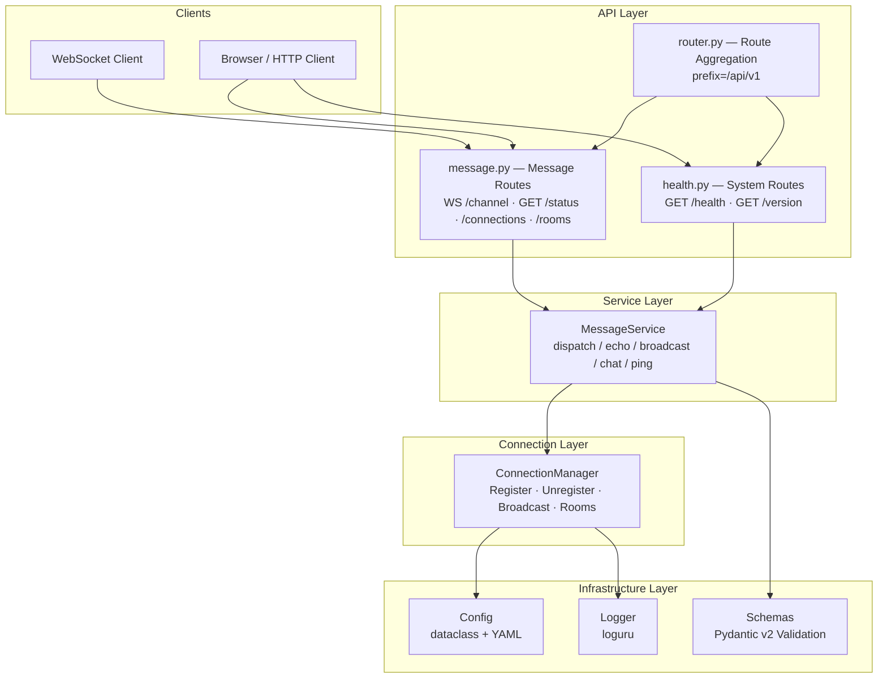
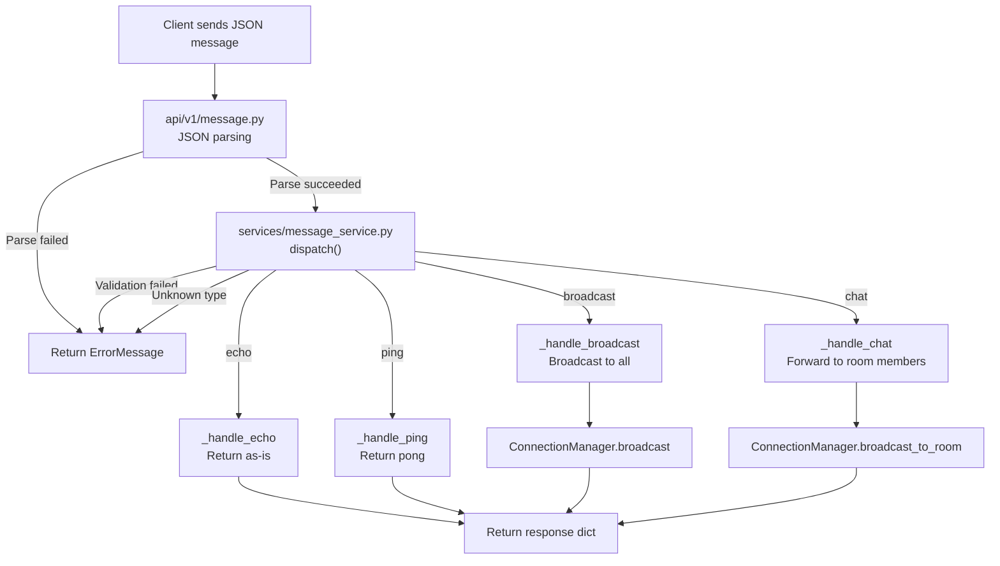

# x-HanChuan

English | [中文](README.md)

**x-HanChuan** is a real-time communication service built on the WebSocket protocol, supporting core messaging patterns including echo, broadcast, room chat, and heartbeat keep-alive. It is designed for instant messaging, real-time notifications, collaborative editing, and other scenarios requiring low-latency bidirectional communication.

## Features

- **Layered Architecture** — Clean separation between API routing, business service, and connection management layers
- **Versioned API** — All endpoints unified under the `/api/v1` prefix for future evolution
- **Multi-pattern Message Routing** — Echo, Broadcast, Room Chat, Ping/Pong heartbeat
- **Pydantic v2 Validation** — Strongly-typed message models with structured inbound/outbound guarantees
- **Connection Lifecycle Management** — Automatic registration/deregistration, room mechanism, empty room cleanup
- **Structured Logging** — loguru dual-mode output (JSON for production / colored console for development), log rotation and auto-cleanup
- **Configuration-driven** — dataclass + YAML config, supports `.env` / `config.yaml` / environment variables, multi-environment switching
- **Containerized Deployment** — Docker multi-stage build, tini PID 1, non-root execution, Docker Compose orchestration

## Project Structure

```
x-HanChuan/
├── src/                            # Source root
│   ├── __init__.py                 # Package metadata
│   ├── main.py                     # App entry (FastAPI + CLI + lifespan management)
│   ├── api/                        # API routing layer
│   │   ├── __init__.py             # Router module exports
│   │   ├── router.py               # Route aggregator (registers v1 routes)
│   │   ├── response.py             # Unified JSON response builder
│   │   └── v1/                     # v1 version routes
│   │       ├── __init__.py
│   │       ├── health.py           # System routes (/health, /version)
│   │       └── message.py          # WebSocket route (/channel) and management endpoints
│   ├── services/                   # Business service layer
│   │   ├── __init__.py
│   │   └── message_service.py      # Message processing (echo/broadcast/chat/ping)
│   ├── connection/                 # Connection management layer
│   │   └── manager.py              # WebSocket connection manager (register/unregister/broadcast/rooms)
│   ├── schemas/                    # Data model layer (Schemas)
│   │   ├── __init__.py
│   │   ├── common.py               # Common response models (ApiResponse / pagination)
│   │   ├── health.py               # Health check response models
│   │   └── message.py              # Pydantic message models (BaseMessage hierarchy)
│   ├── constants/                  # Constants and enums
│   │   ├── __init__.py
│   │   ├── constants.py            # Global constants (APP_NAME / APP_VERSION / API_PREFIX)
│   │   ├── enums.py                # Business enums (MessageType / CommonStatus)
│   │   └── base.py                 # Describable enum base class
│   └── core/                       # Core infrastructure
│       ├── __init__.py
│       ├── config.py               # dataclass + YAML config (Settings singleton)
│       └── logger.py               # loguru logging (JSON / colored console)
├── examples/                       # Reference client implementations
│   ├── 01_echo.py                  # Echo
│   ├── 02_broadcast.py             # Broadcast
│   ├── 03_room_chat.py             # Room chat
│   └── 04_heartbeat.py             # Heartbeat detection
├── pyproject.toml                  # Project config and dependency declarations
├── uv.lock                         # Dependency lock file (committed to Git)
├── uv.toml                         # uv package manager config
├── Dockerfile                      # Docker multi-stage build
├── docker-compose.yml              # Docker Compose orchestration
├── config.yaml.example             # YAML config reference
├── .env.example                    # Environment variables reference
├── LICENSE                         # MIT License
├── README.md                       # Chinese documentation
└── README.en.md                    # English documentation
```

## System Architecture

### Layered Architecture



### Message Processing Flow



## Quick Start

### Requirements

| Item | Requirement |
|------|-------------|
| Python | >= 3.11 |
| Package Manager | [uv](https://docs.astral.sh/uv/) |

**OS Support:**

| Platform | Install Python | Install uv |
|----------|---------------|------------|
| **Windows** | [python.org](https://www.python.org/downloads/) or `winget install Python.Python.3.11` | `powershell -c "irm https://astral.sh/uv/install.ps1 \| iex"` |
| **Linux** | `sudo apt install python3.11` (Debian/Ubuntu) or system package manager | `curl -LsSf https://astral.sh/uv/install.sh \| sh` |
| **macOS** | `brew install python@3.11` | `curl -LsSf https://astral.sh/uv/install.sh \| sh` |

### 1. Clone the Project

```bash
# GitHub
git clone https://github.com/yeyushilai/x-HanChuan.git
cd x-HanChuan

# Gitee
git clone https://gitee.com/yeyushilai/x-HanChuan.git
cd x-HanChuan
```

### 2. Sync Dependencies

```bash
# Sync dependencies (auto-creates .venv and installs all packages)
uv sync

# For development dependencies (pytest / ruff / mypy)
uv sync --dev
```

### 3. Environment Configuration

```bash
cp .env.example .env
```

All configuration items have default values and can run without modification. Full parameter reference:

| Variable | Description | Default |
|----------|-------------|---------|
| `SERVER_HOST` | Server listen address | `0.0.0.0` |
| `SERVER_PORT` | Server listen port | `8000` |
| `SERVER_DEBUG` | Debug mode | `true` |
| `LOGGING_LEVEL` | Log level (DEBUG / INFO / WARNING / ERROR / CRITICAL) | `INFO` |
| `LOGGING_FORMAT` | Log format (`json` for production / `console` for development) | `console` |
| `LOGGING_FILE_PATH` | Log file path | `logs/x-HanChuan-{time}.log` |
| `LOGGING_ROTATION` | Log rotation period | `1 hour` |
| `LOGGING_RETENTION` | Log retention period | `7 days` |
| `CORS_ORIGINS` | Allowed CORS origins (comma-separated) | `*` |

In addition to `.env`, YAML config files are also supported. See [`config.yaml.example`](config.yaml.example) for details.

Config priority: **Environment variables > config.{env}.yaml > config.yaml > Code defaults**.

### 4. Start the Service

There are two ways to start, both equivalent:

#### Method 1: CLI (Recommended)

```bash
# Local development (hot reload)
uv run x-HanChuan --reload

# Production
uv run x-HanChuan --host 0.0.0.0 --port 8000

# View help
uv run x-HanChuan --help
```

#### Method 2: uvicorn directly

```bash
# Local development (hot reload)
uv run uvicorn src.main:app --reload

# Production
uv run uvicorn src.main:app --host 0.0.0.0 --port 8000
```

#### Method 3: Docker Container Deployment

```bash
# Build and start
docker compose up -d --build

# View logs
docker compose logs -f

# Stop
docker compose down
```

After starting, visit:
- API Documentation (Swagger): http://localhost:8000/docs
- API Documentation (ReDoc): http://localhost:8000/redoc
- Health Check: http://localhost:8000/api/v1/health

### 5. Common Engineering Commands

```bash
# Run tests
uv run pytest
uv run pytest --cov=src --cov-report=html

# Code formatting
uv run black src/
uv run isort src/

# Static analysis
uv run ruff check src/
uv run mypy src/

# View help
uv run x-HanChuan --help
```

## API Endpoints

All endpoints are unified under the `/api/v1` prefix.

| Method | Path | Description |
|--------|------|-------------|
| `GET` | `/api/v1/health` | Health check (status, version, environment) |
| `GET` | `/api/v1/version` | Version information |
| `WS` | `/api/v1/channel` | WebSocket communication endpoint |
| `GET` | `/api/v1/status` | WebSocket service status overview (active connections, rooms) |
| `GET` | `/api/v1/connections` | Online connection client ID list |
| `GET` | `/api/v1/rooms` | Active rooms and member list |
| `GET` | `/docs` | Swagger UI interactive documentation |
| `GET` | `/redoc` | ReDoc documentation |

## Examples

### Example 1 — Echo

The most basic WebSocket communication pattern. Client sends a message, server returns it as-is.

```json
// Client sends
{"type": "echo", "content": "Hello"}
// Server returns (as-is)
{"type": "echo", "content": "Hello", "timestamp": 1726000000.0}
```

### Example 2 — Broadcast

One-to-many communication. Client sends a broadcast message, server forwards to all connected clients.

```json
// Client sends
{"type": "broadcast", "content": "Hello everyone"}
// Server forwards to all (with sender field to identify the sender)
{"type": "broadcast", "content": "Hello everyone", "sender": "a1b2c3d4", "timestamp": 1726000000.0}
```

### Example 3 — Room Chat

Room mechanism. After joining a specified room, messages are only forwarded to other members in the same room (not echoed to the sender).

```json
// Client sends
{"type": "chat", "content": "Message in room", "room_id": "demo_room"}
// Server forwards to other room members
{"type": "chat", "content": "Message in room", "room_id": "demo_room", "sender": "a1b2c3d4", "timestamp": 1726000000.0}
```

### Example 4 — Heartbeat

Ping/Pong keep-alive detection. Client periodically sends Ping, server replies with Pong, used for connection liveness detection and latency measurement.

```json
// Client sends
{"type": "ping", "seq": 1}
// Server returns
{"type": "pong", "timestamp": 1726000000.0}
```

## Tech Stack

| Category | Technology |
|----------|------------|
| **Web Framework** | [FastAPI](https://fastapi.tiangolo.com/) — High-performance async web framework |
| **ASGI Server** | [Uvicorn](https://www.uvicorn.org/) — ASGI server based on uvloop |
| **WebSocket** | [websockets](https://websockets.readthedocs.io/) — Python WebSocket library |
| **Data Validation** | [Pydantic v2](https://docs.pydantic.dev/) — Strongly-typed data models |
| **Configuration** | dataclass + [PyYAML](https://pyyaml.org/) — YAML config files + environment variables |
| **CLI Tool** | [argparse](https://docs.python.org/3/library/argparse.html) — Python stdlib CLI parsing |
| **Logging** | [loguru](https://github.com/Delgan/loguru) — Elegant Python logging library |
| **Package Manager** | [uv](https://docs.astral.sh/uv/) — High-performance Python package manager |
| **Code Quality** | [Ruff](https://docs.astral.sh/ruff/) / [Black](https://black.readthedocs.io/) / [mypy](https://mypy.readthedocs.io/) |

## Development Guide

### Coding Standards

| Item | Standard |
|------|----------|
| **Language** | Docstrings, comments, logs, CLI help use **English**; code identifiers in English |
| **Imports** | Relative imports within `src/` (e.g., `from ..schemas.message import ...`) |
| **Docstrings** | Google style, with `Args:` / `Returns:` / `Raises:` sections |
| **Type Annotations** | All function signatures require type annotations |
| **Logging** | Use loguru, import `logger` from `src.core.logger` |
| **Naming** | Classes PascalCase, functions snake_case, private methods `_prefix`, enum members UPPER_SNAKE_CASE |
| **Line Width** | 88 (ruff + black) |

### Layer Responsibilities

| Layer | Directory | Responsibility |
|-------|-----------|----------------|
| **API Routing** | `src/api/` | HTTP/WS endpoint registration, JSON parsing, error writing |
| **Business Service** | `src/services/` | Message validation, business dispatch, status queries |
| **Connection Management** | `src/connection/` | WebSocket connection registration/unregistration, broadcast, room management |
| **Data Models** | `src/schemas/` | Pydantic model definitions (request/response/message) |
| **Constants** | `src/constants/` | Global constants, enum definitions |
| **Infrastructure** | `src/core/` | Configuration loading, logging system |

### Run Tests

```bash
uv run pytest
uv run pytest --cov=src --cov-report=html
```

### Code Checks

```bash
uv run ruff check src/       # lint
uv run black src/            # format
uv run isort src/            # import sorting
uv run mypy src/             # type checking
```

## License

This project is open source under the [MIT License](LICENSE).

## References

- [FastAPI Documentation](https://fastapi.tiangolo.com/)
- [WebSocket Protocol (RFC 6455)](https://datatracker.ietf.org/doc/html/rfc6455)
- [Pydantic Documentation](https://docs.pydantic.dev/)
- [uv Documentation](https://docs.astral.sh/uv/)

## Contact

- **Author**: John Young（夜雨诗来）
- **Email**: [john.young@foxmail.com](mailto:john.young@foxmail.com)
- **Gitee**: [https://gitee.com/yeyushilai](https://gitee.com/yeyushilai)
- **GitHub**: [https://github.com/yeyushilai](https://github.com/yeyushilai)
