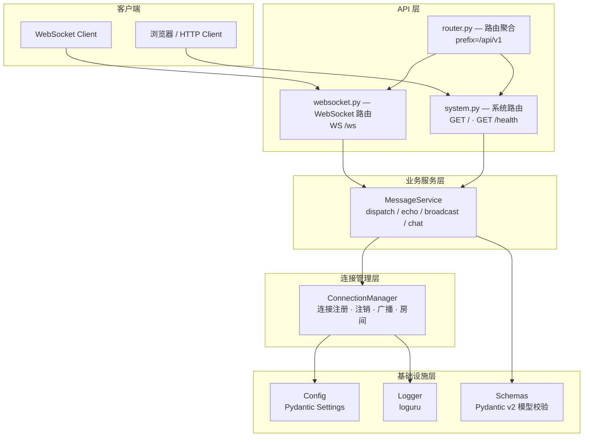
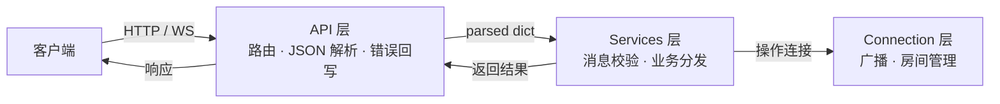
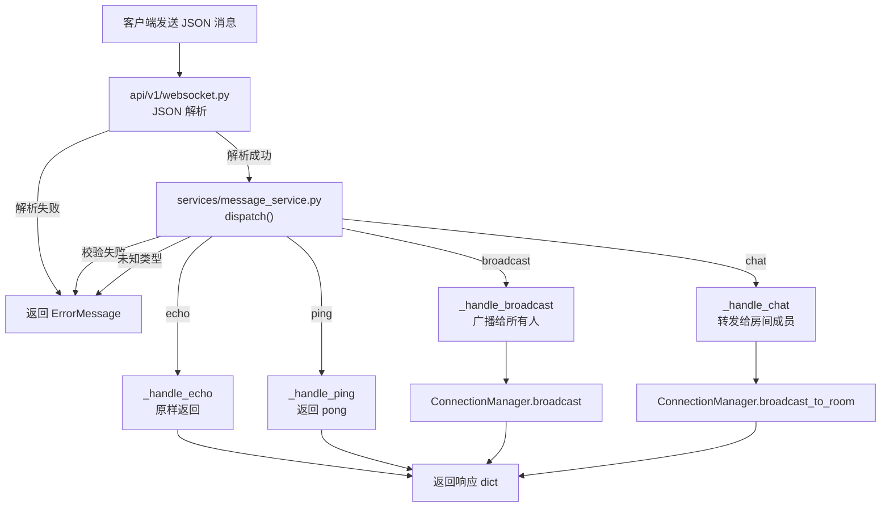

# 汉川（x-HanChuan）

[English](README.en.md) | 中文

`汉川（x-HanChuan）` 是一个基于 WebSocket 协议的实时通信服务，支持回显、广播、房间聊天、心跳保活等核心消息模式。适用于即时通讯、实时通知、协同编辑、在线协作等需要低延迟双向通信的业务场景。

## 核心特征

- **分层架构** — API 路由层、业务服务层、连接管理层职责清晰分离
- **版本化 API** — 所有接口统一挂载 `/api/v1` 前缀，便于后续演进
- **多模式消息路由** — Echo 回显、Broadcast 广播、Room Chat 房间聊天、Ping/Pong 心跳保活
- **Pydantic v2 数据校验** — 所有消息模型强类型校验，入站/出站消息结构化保障
- **连接生命周期管理** — 自动注册/注销、房间机制、空房间自动清理
- **结构化日志** — loguru 双模式输出（JSON 生产环境 / 彩色控制台开发环境），日志轮转与自动清理
- **配置驱动** — Pydantic Settings 统一配置，支持 `.env` 文件与环境变量，类型安全
- **容器化部署** — Docker 多阶段构建、tini PID 1、非 root 运行、Docker Compose 编排

## 项目结构

```
x-HanChuan/
├── src/                            # 源码根目录
│   ├── __init__.py                 # 包元数据
│   ├── main.py                     # 应用入口（FastAPI + CLI + 生命周期管理）
│   ├── api/                        # API 路由层
│   │   ├── __init__.py             # 路由模块导出
│   │   ├── router.py               # 路由聚合器（统一注册 v1 路由）
│   │   ├── response.py             # 统一 JSON 响应构造
│   │   └── v1/                     # v1 版本路由
│   │       ├── __init__.py
│   │       ├── system.py           # 系统路由（/、/health）
│   │       └── websocket.py        # WebSocket 路由（/ws）
│   ├── services/                   # 业务服务层
│   │   ├── __init__.py
│   │   └── message_service.py      # 消息业务处理（echo/broadcast/chat/ping）
│   ├── connection/                 # 连接管理层
│   │   └── manager.py              # WebSocket 连接管理器（注册/注销/广播/房间）
│   ├── schemas/                    # 数据模型层（Schemas）
│   │   ├── __init__.py
│   │   ├── common.py               # 通用响应模型（ApiResponse / 分页模型）
│   │   └── message.py              # Pydantic 消息模型（BaseMessage 继承体系）
│   ├── constants/                  # 常量与枚举
│   │   ├── __init__.py
│   │   ├── constants.py            # 全局常量（APP_NAME / APP_VERSION / API_PREFIX 等）
│   │   ├── enums.py                # 业务枚举（MessageType / CommonStatus）
│   │   └── base.py                 # 可描述枚举基类
│   └── core/                       # 核心基础设施
│       ├── __init__.py
│       ├── config.py               # Pydantic Settings 配置类
│       └── logger.py               # loguru 日志（JSON / 彩色控制台）
├── examples/                       # 参考客户端实现
│   ├── 01_echo.py                  # Echo 回显
│   ├── 02_broadcast.py             # 广播
│   ├── 03_room_chat.py             # 房间聊天
│   └── 04_heartbeat.py             # 心跳检测
├── pyproject.toml                  # 项目配置与依赖声明
├── uv.lock                         # 依赖锁定文件（提交到 Git）
├── uv.toml                         # uv 包管理器配置
├── Dockerfile                      # Docker 多阶段构建
├── docker-compose.yml              # Docker Compose 编排
├── config.yaml.example             # YAML 配置参考
├── .env.example                    # 环境变量参考
├── LICENSE                         # MIT 许可证
├── README.md                       # 中文文档
└── README.en.md                    # 英文文档
```

## 系统架构

### 分层架构



### 请求流转流程



### 消息处理流程



## 快速开始

### 环境要求

| 项目 | 要求 |
|------|------|
| Python | >= 3.11 |
| 包管理器 | [uv](https://docs.astral.sh/uv/) |

**操作系统支持：**

| 平台 | 安装 Python | 安装 uv |
|------|------------|---------|
| **Windows** | [python.org](https://www.python.org/downloads/) 或 `winget install Python.Python.3.11` | `powershell -c "irm https://astral.sh/uv/install.ps1 \| iex"` |
| **Linux** | `sudo apt install python3.11` (Debian/Ubuntu) 或系统包管理器 | `curl -LsSf https://astral.sh/uv/install.sh \| sh` |
| **macOS** | `brew install python@3.11` | `curl -LsSf https://astral.sh/uv/install.sh \| sh` |

### 1. 克隆项目

```bash
# Gitee
git clone https://gitee.com/yeyushilai/x-HanChuan.git
cd x-HanChuan

# GitHub
git clone https://github.com/yeyushilai/x-HanChuan.git
cd x-HanChuan
```

### 2. 同步依赖

```bash
# 同步依赖（自动创建 .venv 并安装所有包）
uv sync

# 如需开发依赖（pytest / ruff / mypy 等）
uv sync --dev
```

### 3. 环境配置

```bash
cp .env.example .env
```

所有配置项均有默认值，无需修改即可运行。完整参数说明：

| 变量名 | 说明 | 默认值 |
|--------|------|--------|
| `HOST` | 服务器监听地址 | `0.0.0.0` |
| `PORT` | 服务器监听端口 | `8000` |
| `DEBUG` | 调试模式 | `true` |
| `LOG_LEVEL` | 日志级别（DEBUG / INFO / WARNING / ERROR / CRITICAL） | `INFO` |
| `LOGGING_FORMAT` | 日志格式（`json` 生产环境 / `console` 开发环境） | `console` |

### 4. 启动服务

有两种启动方式，效果相同：

#### 方式一：CLI 启动（推荐）

```bash
# 本地开发（热重载）
uv run x-HanChuan --reload

# 生产环境
uv run x-HanChuan --host 0.0.0.0 --port 8000

# 查看帮助
uv run x-HanChuan --help
```

#### 方式二：uvicorn 直接启动

```bash
# 本地开发（热重载）
uv run uvicorn src.main:app --reload

# 生产环境
uv run uvicorn src.main:app --host 0.0.0.0 --port 8000
```

#### 方式三：Docker 容器部署

```bash
# 构建并启动
docker compose up -d --build

# 查看日志
docker compose logs -f

# 停止
docker compose down
```

服务启动后访问：
- API 文档（Swagger）：http://localhost:8000/docs
- API 文档（ReDoc）：http://localhost:8000/redoc
- 健康检查：http://localhost:8000/api/v1/health

### 5. 常用工程命令

```bash
# 运行测试
uv run pytest
uv run pytest --cov=src --cov-report=html

# 代码格式化
uv run black src/
uv run isort src/

# 静态检查
uv run ruff check src/
uv run mypy src/

# 查看当前配置
uv run x-HanChuan --help
```

## API 端点

所有端点统一挂在 `/api/v1` 前缀下。

| 方法 | 路径 | 说明 |
|------|------|------|
| `GET` | `/api/v1/` | 服务基本信息 |
| `GET` | `/api/v1/health` | 健康检查（在线连接数、房间数） |
| `WS` | `/api/v1/ws` | WebSocket 通信端点 |
| `GET` | `/docs` | Swagger UI 交互式文档 |
| `GET` | `/redoc` | ReDoc 文档 |

## 示例说明

### 示例 1 — Echo（回显）

最基础的 WebSocket 通信模式。客户端发送消息，服务器原样返回。

```json
// 客户端发送
{"type": "echo", "content": "你好"}
// 服务器返回（原样）
{"type": "echo", "content": "你好", "timestamp": 1726000000.0}
```

### 示例 2 — Broadcast（广播）

一对多通信。客户端发送广播消息，服务器转发给所有已连接客户端。

```json
// 客户端发送
{"type": "broadcast", "content": "大家好"}
// 服务器转发给所有人（含 sender 字段标识发送者）
{"type": "broadcast", "content": "大家好", "sender": "a1b2c3d4", "timestamp": 1726000000.0}
```

### 示例 3 — Room Chat（房间聊天）

房间机制。客户端加入指定房间后，消息仅转发给同一房间内的其他成员（不回显给发送者）。

```json
// 客户端发送
{"type": "chat", "content": "房间里的消息", "room_id": "demo_room"}
// 服务器转发给同房间其他成员
{"type": "chat", "content": "房间里的消息", "room_id": "demo_room", "sender": "a1b2c3d4", "timestamp": 1726000000.0}
```

### 示例 4 — Heartbeat（心跳）

Ping/Pong 保活检测。客户端定期发送 Ping，服务器回复 Pong，用于检测连接存活和测量延迟。

```json
// 客户端发送
{"type": "ping", "seq": 1}
// 服务器返回
{"type": "pong", "timestamp": 1726000000.0}
```

## 技术栈

| 分类 | 技术 |
|------|------|
| **Web 框架** | [FastAPI](https://fastapi.tiangolo.com/) — 高性能异步 Web 框架 |
| **ASGI 服务器** | [Uvicorn](https://www.uvicorn.org/) — 基于 uvloop 的 ASGI 服务器 |
| **WebSocket** | [websockets](https://websockets.readthedocs.io/) — Python WebSocket 库 |
| **数据校验** | [Pydantic](https://docs.pydantic.dev/) / [Pydantic Settings](https://docs.pydantic.dev/latest/concepts/pydantic_settings/) |
| **CLI 工具** | [argparse](https://docs.python.org/3/library/argparse.html) — Python 标准库命令行解析 |
| **日志** | [loguru](https://github.com/Delgan/loguru) — 简洁优雅的 Python 日志库 |
| **包管理** | [uv](https://docs.astral.sh/uv/) — 高性能 Python 包管理器 |
| **代码质量** | [Ruff](https://docs.astral.sh/ruff/) / [Black](https://black.readthedocs.io/) / [mypy](https://mypy.readthedocs.io/) |

## 开发指南

### 编码规范

| 项目 | 规范 |
|---|---|
| **语言** | 文档字符串、注释、日志、CLI 帮助使用**简体中文**；代码标识符使用英文 |
| **导入** | `src/` 内使用相对导入（如 `from ..schemas.message import ...`） |
| **文档字符串** | Google 风格，包含 `Args:` / `Returns:` / `Raises:` |
| **类型标注** | 所有函数签名均需类型注解 |
| **日志** | 使用 loguru，从 `src.core.logger` 导入 `logger` |
| **命名** | 类名 PascalCase，函数名 snake_case，私有方法 `_前缀`，枚举成员 UPPER_SNAKE_CASE |
| **行宽** | 88（ruff + black） |

### 分层职责

| 层级 | 目录 | 职责 |
|------|------|------|
| **API 路由层** | `src/api/` | HTTP/WS 端点注册、JSON 解析、错误回写 |
| **业务服务层** | `src/services/` | 消息校验、业务分发、状态查询 |
| **连接管理层** | `src/connection/` | WebSocket 连接注册/注销、广播、房间管理 |
| **数据模型层** | `src/schemas/` | Pydantic 模型定义（请求/响应/消息） |
| **常量层** | `src/constants/` | 全局常量、枚举定义 |
| **基础设施层** | `src/core/` | 配置加载、日志系统 |

### 运行测试

```bash
uv run pytest
uv run pytest --cov=src --cov-report=html
```

### 代码检查

```bash
uv run ruff check src/       # lint
uv run black src/            # 格式化
uv run isort src/            # import 排序
uv run mypy src/             # 类型检查
```

## 许可证

本项目基于 [MIT 许可证](LICENSE) 开源。

## 参考资料

- [FastAPI 官方文档](https://fastapi.tiangolo.com/)
- [WebSocket 协议 (RFC 6455)](https://datatracker.ietf.org/doc/html/rfc6455)
- [Pydantic 官方文档](https://docs.pydantic.dev/)
- [uv 官方文档](https://docs.astral.sh/uv/)

## 联系方式

- **作者**：John Young（夜雨诗来）
- **邮箱**：[john.young@foxmail.com](mailto:john.young@foxmail.com)
- **Gitee**：[https://gitee.com/yeyushilai](https://gitee.com/yeyushilai)
- **GitHub**：[https://github.com/yeyushilai](https://github.com/yeyushilai)
